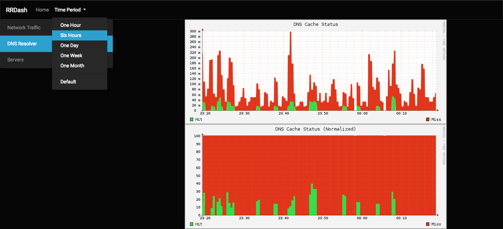

# RRDash
RRDash is a good looking and flexible dashboard for rrdtool graphs

## About RRDash
I have been using `rrdtool` for quite a few years. I've used several existing
dashboards, but I did not like any one of them in particular. They were either
too complicated, or needed too much to be set up, or in general had something
that threw me off. For this reason, I turned to Grafana, but truth be told,
setting up an InfluxDB, a Grafana server, and a lot more stuff, just isn't
always worth it. Plus, some may argue that `rrdtool` looks better.. ;-)

Every time I set up something that was monitored with `rrdtool`, I always had
a custom script, PHP, Python, or similar, that would produce the graphs. I
started from a cron generating the PNGs every 5' and then serving them, and
then moved to on-demand generation. But every time I had a different solution.

As I was setting up a couple of new installations of `collectd`, I realized
that this doesn't scale, and created *RRDash*, which is a generic dashboard
for `rrdtool`-generated graphs. It is flexible, and it allows you to generate
any possible graph, since you can manually enter the arguments passed to
`rrdgraph`. It allows for short configuration, by using macros (actually more
like C's `#define`). It can show a beautiful GUI, with all the categories,
and some defined time frames (last day, week, etc.).

In the two included screenshots you can see some data from my home setup. The
first one is some network graphs (an Internet connection and the servers' LAN
traffic), and in the second, right above, you can see some statistics on cache
hit and miss from my local DNS resolver.

## Installation
In order to install the software, you just extract it into a path that is
served by a web server that supports PHP. It is recommended to use PHP 7 or
later, but PHP 5 works as well. You also need `rrdtool` installed in the server
of course, so the graphs can be produced.

### Configuration
To configure *RRDash*, there are three files currently, all inside the `config`
folder. All files contain a large amount of comments to provide you with some
help on how they work, but they are pretty basic.

#### categories.php
This file contains all the categories defined in the system. Each category can
contain one or more graphs. A graph can appear in more than one category if
needed. These categories will show up in the left column of *RRDash*. They can
be anything that makes sense to you. For example, if you have network traffic,
you can have one category for every city, and maybe one master category that
will provide a general, single-page view, of the entire network.

#### graphs.php
In this file you need to define all the graphs. Each graph has a unique ID, and
you add this here. It will be executed as a PHP file, so you can even include
PHP functions inside the graph definition, like `strftime()`, etc.

#### periods.php
This file contains all the predefined periods that will appear in *RRDash*'s
menu. Each period has a `from` and a `to`, which can be either a UNIX
timestamp, or, if they start with `-`, a time, relative to the current one.
These are basically passed to `rrdtool` itself, in the `-s` and `-e` arguments.
You can configure as many of them as you need, but some are included already
as a bonus, since they're the most popular ones.

## Security
In order for *RRDash* to be flexible, and without requiring thousands of lines
of code, a shortcut has been taken in its design, that increases the security
risk, but a lot have been done to ensure that this risk is minimal, and is
currently considered low.

Currently, to generate the graphs, *RRDash* passes **shell** commands via
PHP's `passthru()` function, to the operating system. This is dangerous, and
if not handled properly can lead to **remote code execution**. However, in
this particular case, it is believed that this risk is **not** present, but
you still need to know this beforehand. For a deeper analysis and explanation,
look inside the `rrd.php` file, and more specifically the end of the file.

As a TL;DR, what you need to know is that the risk is minimal, and basically
only the system operator can cause damage, but this is something that is not
within any web application's threat model.

However, if this makes you uncomfortable, and you don't want to use *RRDash*,
this is perfectly fine. Your decision is understandable.

In terms of access control, *RRDash* has **no** access control. That means that
it is up to you to ensure that only authorized people have access to the page.
This can be done with firewall rules, web server configuration, or HTTP Basic
Authentication. Plans for adding access control, using HTTP Basic Auth exist,
so it may be something that's coming soon.